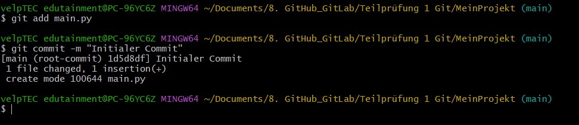

Dokumentation: MeinProjekt
1. GitHub Repository einrichten
    Ich habe mich bei Git Hub angemeldet und ein neues Repository erstellt, mit dem Namen MeinProjekt.
        
        
        

2. Prüfung SSH-Schlüssel und Erstellung
    Ich habe geprüft ob bereits ein SSH-Schlüssel vorhanden ist oder erstellt werden muss. Da keiner vorhanden war habe ich diesen erstellt.
        
        

3. Klonen des Repositorys, konfigurieren von Git, erstellen von initialem Commit
    Ich habe das Repository geklont, git mit meinem Namen und meiner Mailadresse konfiguriert und einen initialen commit erstellt.
        
        
        
        
        

4. Branch feature erstellen, neue Datei und commit
    Ich habe einen neuen Branch mit dem Namen feature erstellt, in diesem einen neuen Unterordner utils mit der Datei database.py darin und davon wurde dann ein commit erstellt. Dann wurde die eine Änderung in der Hauptdatei main.py vorgenommen und diese commited.
        
        
        

5. Schritte zum Merge des feature- Branches in den main- Branch
    Zuerst wechselte ich wieder in den main-branch, dort wurde dann die Hauptdatei main.py noch einmal bearbeitet und danach ein commit durchgeführt. Nun wurde ein merge des feature-Branch in den main- Branch versucht der zum Konflikt führte.
        
        
        
        